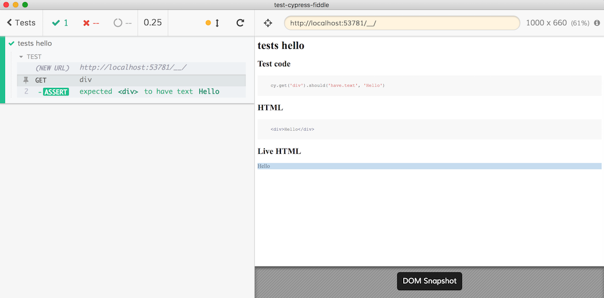

# cypress-fiddle [](https://circleci.com/gh/cypress-io/cypress-fiddle/tree/master)
> Generate Cypress tests from HTML and JS

## Install

After installing Cypress with `npm i -D cypress` add this module

```shell
npm i -D @cypress/fiddle
```

Then load the custom command by adding the following line to `cypress/support/index.js`

```js
// adds "cy.runExample()" command
import '@cypress/fiddle'
```

## Use

### Create a single test

You can take an object with HTML and test commands and run it. For example in the `cypress/integration/spec.js` file

```js
// loads TypeScript definition for Cypress
// and "cy.runExample" custom command
/// <reference types="@cypress/fiddle" />

const test = {
  html: `
    <div>Hello</div>
  `,
  test: `
    cy.get('div').should('have.text', 'Hello')
  `
}

it('tests hello', () => {
  cy.runExample(test)
})
```

Which produces



### Parameters

The test object can have multiple properties, see [src/index.d.ts](src/index.d.ts)

- `test` JavaScript with Cypress commands, required

The rest of the properties are optional

- `html` to mount as DOM nodes before the test begins
- `name` is the name to display at the top of the page, otherwise the test title will be used
- `description` gives extra test description under the name

The next properties are NOT used by `cy.runExample` but are used by the `testExamples` function from this package.

- `skip` creates a skipped test with `it.skip`
- `only` creates an exclusive test with `it.only`

